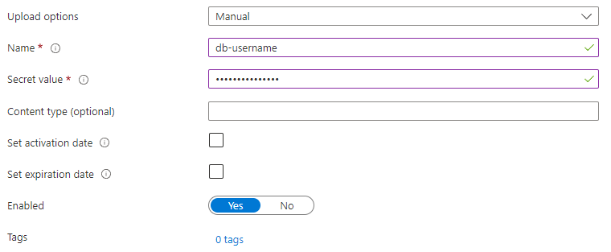

<style scoped>
  section {
    justify-content: center;
  }
</style>

# Azure AD authentication for MSSQL

---

## Varslingsportal

- Application written in Haskell
- Runs in a Docker container on a Azure App Service
- Microsoft SQL Server database on Azure
- Communicates through ODBC with FreeTDS

---

<style scoped>
  section {
    justify-content: center;
  }
  h2 {
    text-align: center;
  }
</style>

## How we connect to the database

---

### Create DB user

Grant privileges.

```sql
-- in `master` db
CREATE LOGIN application WITH PASSWORD = 'applicationPassword';
-- in application db
CREATE USER application FOR LOGIN application;
GRANT SELECT, INSERT, UPDATE, DELETE, EXECUTE TO application;
```

---

### Add credentials to Key Vault



---

### Get credentials from Key Vault in Terraform

```hcl
resource "azurerm_key_vault" "main" {
  // ...
}

data "azurerm_key_vault_secret" "db_username" {
  name         = "db-username"
  key_vault_id = azurerm_key_vault.main.id
}

data "azurerm_key_vault_secret" "db_password" {
  name         = "db-password"
  key_vault_id = azurerm_key_vault.main.id
}
```

---

### Pass credentials to application

Spread over multiple lines for readability.

```terraform
resource "azurerm_mssql_server" "main" {
  // ...
}

module "app" {
  name = "application"
  // ...
  app_settings = {
    // ...
    "DB_CONNECTION_STRING" = <<-EOT
      Driver={ODBC Driver 18 for SQL Server};
      Server={${azurerm_mssql_server.main.fully_qualified_domain_name}};
      Database={${azurerm_mssql_database.main.name}};
      Uid=${azurerm_key_vault_secret.db_username.value};
      Pwd=${azurerm_key_vault_secret.db_password.value};
      Encrypt=yes;
    EOT
  }
}
```

---

## Problem

Secrets are:

- Kept in TF state
- Possible to leak
- Annoying to deal with

---

<style scoped>
  section {
    justify-content: center;
  }
  h2 {
    text-align: center;
  }
</style>

## Using managed identities as DB server users

---

### Create AD group for database admins

```diff
+ resource "azuread_group" "db_admins" {
+   display_name     = "db-admins-${var.environment}"
+   owners           = [data.azuread_client_config.current.object_id]
+   security_enabled = true
+ }
+
+ resource "azuread_group_member" "db_admin_user" {
+   for_each         = data.azuread_user.db_admins
+   group_object_id  = azuread_group.db_admins.object_id
+   member_object_id = each.value.object_id
+ }
+
+ data "azuread_user" "db_admins" {
+   for_each            = toset(local.admin_users)
+   user_principal_name = each.value
+ }
+
+ locals {
+   admin_users = ["foo.bar@coop.no"]
+ }
```

---

### Set AD group as database admin

```diff
  resource "azurerm_mssql_server" "main" {
    name = "db-server-name"
    // ...

+   identity {
+     type = "SystemAssigned"
+   }

+   azuread_administrator {
+     login_username = "Azure AD Administrator"
+     object_id      = azuread_group.db_admins.object_id
+   }
  }
```

---

### Log in to database with an admin

- Using SQL Server Management Studio (SSMS)
  - Built-in support
- Using `Invoke-SqlCmd` from Powershell
  - Usable through SSH

---

#### Using Powershell

```powershell
#Requires -Modules Az, SqlServer

$DBServer = 'db-server-name'
$DBName = 'db-name'
$ServerInstance = $DBServer + '.database.windows.net'

Connect-AzAccount `
  -TenantId $TenantId `
  -Subscription $SubscriptionName `
  -UseDeviceAuthentication

$TokenResponse = Get-AzAccessToken -ResourceUrl https://database.windows.net
$AccessToken = $TokenResponse.Token

Invoke-Sqlcmd `
  -ServerInstance $ServerInstance `
  -Database $DBName `
  -AccessToken $AccessToken `
  -Query 'SELECT 1 + 1'
# -InputFile ./script.sql
```

---

### Create user for application

```sql
-- in `master` db
CREATE USER [application] FROM EXTERNAL PROVIDER
-- in application db
GRANT SELECT, INSERT, UPDATE, DELETE, EXECUTE TO [application];
```

### Update connection string

Spread over multiple lines for readability.

```diff
  module "app" {
    name = "application"
    // ...
    app_settings = {
      // ...
      "DB_CONNECTION_STRING" = <<-EOT
        Driver={ODBC Driver 18 for SQL Server};
        Server={${azurerm_mssql_server.main.  fully_qualified_domain_name}};
        Database={${azurerm_mssql_database.main.name}};
-       Uid=${azurerm_key_vault_secret.db_username.value};
-       Pwd=${azurerm_key_vault_secret.db_password.value};
+       Authentication=ActiveDirectoryMsi;
        Encrypt=yes;
      EOT
    }
  }
```

---

### Disable local user login

```diff
  resource "azurerm_mssql_server" "main" {
    name = "db-server-name"
    // ...

-   administrator_login          = "..."
-   administrator_login_password = "..."

    identity {
      type = "SystemAssigned"
    }

    azuread_administrator {
      login_username              = "Azure AD Administrator"
      object_id                   = azuread_group.db_admins.object_id
+     azuread_authentication_only = true
    }
  }
```

---

### Delete secrets from Terraform

```diff
  resource "azurerm_key_vault" "main" {
    // ...
  }

- data "azurerm_key_vault_secret" "db_username" {
-   name         = "db-username"
-   key_vault_id = azurerm_key_vault.main.id
- }
-
- data "azurerm_key_vault_secret" "db_password" {
-   name         = "db-password"
-   key_vault_id = azurerm_key_vault.main.id
- }
```

---

### Delete secret from Key Vault


---

### Benefits

- No more secrets!
- Based on identity, not on credentials

---

### Drawbacks

- Messy documentation
  - 
- No support outside of select drivers

---

## Further work

- Automatically create DB users for identities
  - No manual steps
- Azure RBAC
  - No database-level control (`GRANT SELECT TO application`)

---

<style scoped>
  section {
    justify-content: center;
  }
  h2 {
    text-align: center;
  }
</style>

## Time for bonus?

---

### Actual connection string

```terraform
module "app" {
  name = "application"
  // ...
  app_settings = {
    // ...
    "DB_CONNECTION_STRING" = <<-EOT
      DSN=MSSQLDB;
      Uid=${azurerm_key_vault_secret.db_username.value};
      Pwd=${azurerm_key_vault_secret.db_password.value};
      Encrypt=yes;
    EOT
  }
}
```

---

### /etc/odbc.ini

```ini
[MSSQLDB]
Driver = /usr/lib/x86_64-linux-gnu/odbc/libtdsodbc.so
Server = $DB_CONFIG_HOST
Port = $DB_CONFIG_PORT
Database = $DB_CONFIG_DATABASE
TDS_Version = 7.2
```

---

<style scoped>
  section {
    justify-content: center;
  }
  h3 {
    text-align: center;
  }
</style>

### FreeTDS does not support Azure AD auth

---

### Why FreeTDS to begin with?

- In a hurry
- Most well-known (only?) TDS driver for ODBC on linux
- Proven to work with Haskell

---

### msodbc18

Benefits:

- Support for Azure AD authentication

Drawbacks:

- Only option for Azure AD authentication on linux, probably.

---

<style scoped>
  section {
    justify-content: center;
  }
  h3 {
    text-align: center;
  }
</style>

### Issues

---

#### `NVARCHAR(MAX)`-issue

- Breaks every single query on a table with a `NVARCHAR(MAX)` column
- Fix: convert all `NVARCHAR(MAX)` columns to `NVARCHAR(4000)`

---

#### Encoding

- FreeTDS sent `UTF-8`
- msodbc18 sends `windows-1252`
- Everything in the database had been saved as `UTF-8`
- `ASCII` is a subset of both `windows-1252` and `UTF-8`
- We're in Norway
  - We have special characters
    - They are not a part of `ASCII`
      - They now look like `Ã_,`
- `REPLACE` to the rescue

  ```sql
  UPDATE table SET column=REPLACE(column, 'Ã_,', 'Ø')
  ```

---

##### Datetime overflow

- FreeTDS automatically rounds `Datetime` values to the correct precision
- msodbc18 does not
- MSSQL does not allow incoming date times to overflow the column precision specified
- Round the `Datetime` values ourselves in code

---

### More work to be done

But not enough time... _And it's a dead project..._
